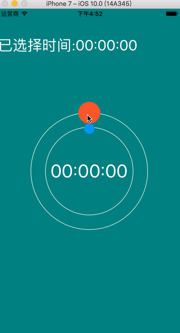

# BSKTimePicker
a beautiful timePicker for iOS 

Demo工程采用Xcode8创建，请用Xcode8打开，如果你使用的是Xcode7，请将BSKTimePicker文件夹导入到你的工程中就可以使用了。

Gif图中可能由于浏览器性能导致不流畅，实际运行不会卡顿。



##How to use：

``` Objective-c

#import "ViewController.h"
#import "BSKTimePicker.h"
@interface ViewController ()<BSKTimPickerDelegate>
@property (nonatomic,strong) BSKTimePicker * timePicker;
@property (nonatomic,strong) UILabel * timeLabel;
@end

@implementation ViewController

- (void)viewDidLoad {
    [super viewDidLoad];
    
    self.view.backgroundColor= [UIColor colorWithRed:0.0f  green:128.0f/255.0f blue:128.0f/255.0f alpha:1.0];
    self.timePicker = [[BSKTimePicker alloc]initWithFrame:CGRectMake(50, 100, 300, 300)];
    self.timePicker.center = self.view.center;
    self.timePicker.minutesPointColor = [UIColor colorWithRed:1.0f green:87.0f/255.0f blue:42.0f/255.0f alpha:1.0f];
    self.timePicker.secondsPointColor = [UIColor colorWithRed:0.0f green:150.0f/255.0f blue:1.0f alpha:1.0f];
    self.timePicker.minutesCircleColor = [UIColor whiteColor];
    self.timePicker.secondsCircleColor = [UIColor whiteColor];
    self.timePicker.textColor = [UIColor whiteColor];
    self.timePicker.delegate = self;
    [self.view addSubview:self.timePicker];
    
    self.timeLabel = [[UILabel alloc]init];
    self.timeLabel.text = @"当前时间:00:00:00";
    self.timeLabel.textColor = [UIColor whiteColor];
    self.timeLabel.font = [UIFont systemFontOfSize:30];
    self.timeLabel.frame = CGRectMake(0, 50, 400, 50);
    [self.view addSubview:self.timeLabel];
    
}

-(void)BSKTimePiker:(BSKTimePicker *)timePicker DidSelectedTimeWithHours:(NSInteger)hours Minutes:(NSInteger)minutes Seconds:(NSInteger)seconds{
    
    self.timeLabel.text = [NSString stringWithFormat:@"已选择时间:%.2ld:%.2ld:%.2ld",hours,minutes,seconds];
}

-(void)BSKTimePiker:(BSKTimePicker *)timePicker timeDidChangedWithHours:(NSInteger)hours Minutes:(NSInteger)minutes Seconds:(NSInteger)seconds{
    
    self.timeLabel.text = [NSString stringWithFormat:@"当前时间:%.2ld:%.2ld:%.2ld",hours,minutes,seconds];
}


@end

```